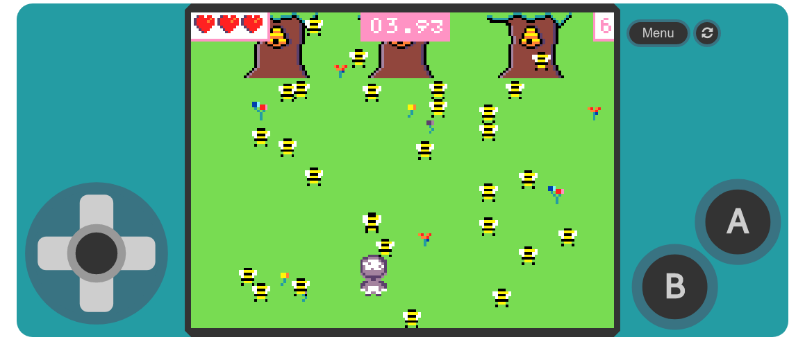

# Andrewski's Arcade

## MakeCode Arcade Games
### [Knee of the Bee](https://andrew-ski.github.io/knee-of-the-bee/)

Catch as many bees as possible in each, increasingly difficult, 15 second round. Avoid the red Killer bee. 
Play Single Player, Two-Player Co-Op or Two-Player Versus modes.
