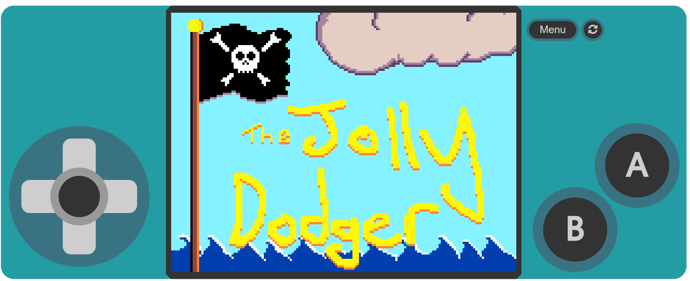

# Andrewski's Arcade
## MakeCode Arcade Games
### [The Jolly Dodger](https://andrew-ski.github.io/The_jolly_dodger/)

You've recruited a crew of swarthy vermin! Outfit your ship and sail into enemy territory to plunder some booty and steal all the glory!
Dodge enemy fire or you will become someone else's sunken treasure. 
Built with the [2020 MakeCode ArcadeOcean Jam](https://arcade.makecode.com/game jam/ocean) as inspiration.

### [Soggy Socks](https://andrew-ski.github.io/SoggySocks/)

You wore Socks in your sandals to the beach... The tide is coming in and you better run before you end up with... SOGGY SOCKS!
MultiPlayer Mode gives the second player a boogie board that can bounce bonus items to the bottom of the screen.

### [Knee of the Bee](https://andrew-ski.github.io/knee-of-the-bee/)

Catch as many bees as possible in each, increasingly difficult, 15 second round. Avoid the red Killer bee. 
Single Player, Two-Player Co-Op and Two-Player Versus modes.

### [Daddo 2^0](https://andrew-ski.github.io/daddos-escape/)

Your spaceship has crashed on an alien planet. Make your way to puddle-jumper rockets to try to get home.
Single Player.
